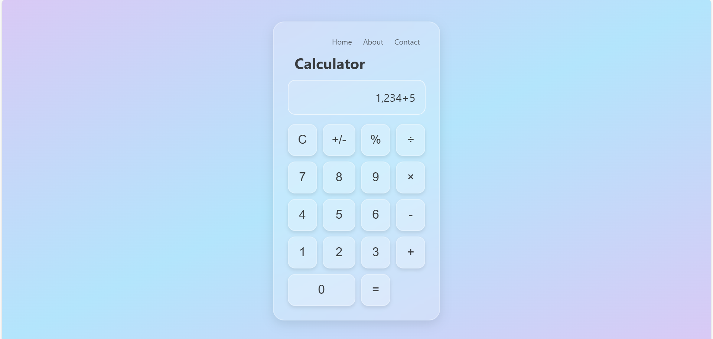

# Calculator UI (Glassmorphism Style)

A simple calculator user interface designed using **Advanced HTML** and **Advanced CSS only**.  
This project demonstrates modern CSS design concepts like:

### ✨ Features:
- ✅ Glassmorphism effect
- ✅ CSS Variables
- ✅ Grid Layout
- ✅ Linear Gradient background
- ✅ Box Shadows & Neumorphism feel
- ✅ Responsive Design

---

### 🚀 Technologies Used:
- HTML5
- CSS3 (with advanced styling)

---

### 📸 Preview:

---

### 📁 Folder Structure:

📁 Calculator  
├── index.html  
├── style.css  
├── README.md  
└── screenshot.png